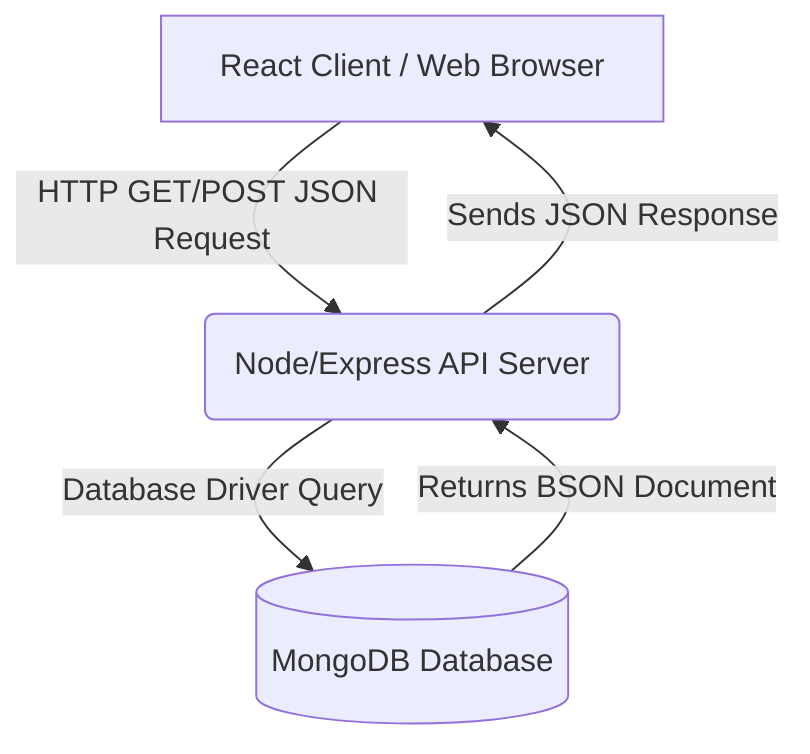
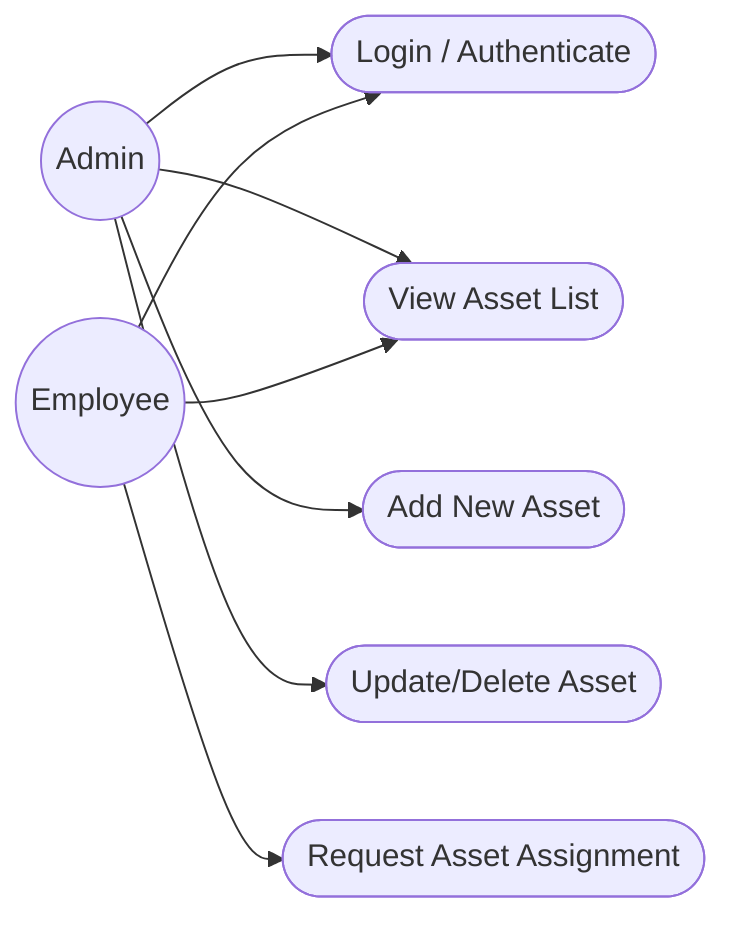
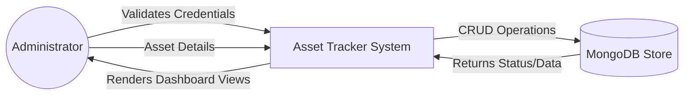
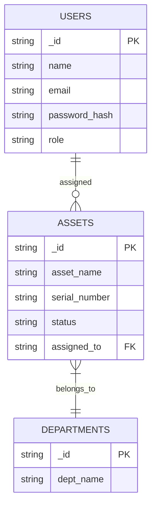

# ABSTRACT

This mini-project report details the design, development, and implementation of a **Web-Based Asset Tracker**, developed during my Full Stack Web Development internship at **temp_company**. Undertaken as a partial fulfillment of the UG Diploma, this project demonstrates the practical application of modern web technologies, specifically the **MERN Stack** (MongoDB, Express.js, React.js, and Node.js).

Traditionally, organizations rely on manual registers or disjointed spreadsheet files to track physical assets, leading to data inconsistency, slow search capabilities, and difficulty in auditing. The objective of this project was to establish a centralized digital solution where administrators and employees can manage and track company items securely.

The system features an interactive dashboard, secure user authentication, and a complete CRUD (Create, Read, Update, Delete) capability for managing assets inventory. Structured methodologies—ranging from requirement gathering and UI component design to backend API creation and database normalization—were deployed throughout the development lifecycle.

Ultimately, this project highlights a successful transition from theoretical academic knowledge to constructing robust, scalable, and responsive web applications in a real-world setting.

# TABLE OF CONTENTS

| SL. No. | Title | Page No. |
| :---: | :--- | :---: |
| | Abstract | 1 |
| **1** | **INTRODUCTION** | **3** |
| 1.1 | Project Overview | 3 |
| 1.2 | Problem Statement & Existing System | 3 |
| 1.3 | Proposed System & Objectives | 4 |
| 1.4 | Advantages of Proposed System | 4 |
| **2** | **SYSTEM REQUIREMENTS & TECHNOLOGIES** | **5** |
| 2.1 | Hardware Requirements | 5 |
| 2.2 | Software Requirements | 5 |
| 2.3 | Technologies Used | 6 |
| **3** | **SYSTEM DESIGN AND ARCHITECTURE** | **7** |
| 3.1 | System Architecture | 7 |
| 3.2 | Use Case Diagram | 8 |
| 3.3 | Data Flow Diagram | 8 |
| 3.4 | Entity Relationship (ER) Diagram | 9 |
| **4** | **IMPLEMENTATION METHODOLOGY** | **10** |
| 4.1 | Planning and Requirement Analysis | 10 |
| 4.2 | Database and API Design | 10 |
| 4.3 | UI Development | 11 |
| 4.4 | Testing & Deployment | 11 |
| **5** | **CONCLUSION AND FUTURE SCOPE** | **12** |
| 5.1 | Conclusion | 12 |
| 5.2 | Future Enhancements | 12 |
| | **REFERENCES** | **13** |

# CHAPTER 1: INTRODUCTION

## 1.1 Project Overview
The **Asset Tracker** is a comprehensive web-based application designed to help organizations monitor, manage, and audit their physical and digital assets effectively. Built dynamically using the MERN stack, the application serves as a centralized inventory system where administrators can assign, track, and maintain the lifecycle of company equipment such as laptops, servers, projectors, and office furniture.

This mini-project was the culmination of my training period at **temp_company**, where I was tasked with bridging the gap between front-end UI design and back-end database engineering. The system provides real-time oversight of asset availability, thereby reducing losses and streamlining auditing processes.

## 1.2 Problem Statement & Existing System
In many small to mid-sized organizations, asset management is traditionally handled manually using physical record books or basic Excel spreadsheets. As an organization scales, it faces significant challenges:
*   Difficulty in quickly searching for a specific asset's history.
*   Data corruption or redundancy due to multiple copies of spreadsheets.
*   No secure authentication or tracking of "who assigned what to whom."
*   Lack of a clear dashboard revealing total active versus damaged assets.

The existing process primarily consists of clerical personnel maintaining manual ledgers. For tracking digital and electronic equipment, department heads utilize standalone Excel files that are occasionally transferred back and forth via email. The existing model requires a designated person to cross-verify physical items periodically against these written constraints.

## 1.3 Proposed System & Objectives
The proposed Asset Tracker system completely mitigates these flaws by taking operations to the browser. The new application utilizes a **Three-Tier Architecture** via secure web APIs (Express.js) that communicate seamlessly with a live database (MongoDB) and provide a rich user interface (React.js).

The primary objectives include:
1.  **Centralization**: Create a single point of truth for all asset records accessible through a web browser.
2.  **Authentication & Security**: Ensure that the system restricts access, allowing only authorized personnel (Admins/IT Staff) to add or remove assets.
3.  **Efficiency**: Develop a responsive interface utilizing React.js that automatically updates search results without needing to refresh the browser.
4.  **Database Scalability**: Store intricate details of assets in a scalable NoSQL database.

## 1.4 Advantages of Proposed System
*   **High Performance Search**: Because of React.js and dynamic component rendering, users can filter items via search bars instantly.
*   **Authentication Validation**: JWT (JSON Web Tokens) are implemented to confirm that a user has valid session credentials to view asset data.
*   **Data Integrity**: Form submissions restrict invalid inputs, thus keeping the database clean.
*   **Responsive Layout**: Utilizing Tailwind CSS ensures the tracker can be effortlessly accessed across desktops, iPads, and mobile phones.

# CHAPTER 2: SYSTEM REQUIREMENTS & TECHNOLOGIES

Identifying technical requirements is crucial for ensuring the project runs flawlessly in developer and production environments. This chapter merges hardware specifications, basic operational software, and the profound technical stack required.

## 2.1 Hardware Requirements
The minimum hardware necessary for running both the server and client-side applications smoothly:

| Category | Requirement Specification |
| :--- | :--- |
| **Processor** | Intel Core i3 / AMD Ryzen 3 or higher |
| **Memory (RAM)** | 4 GB (8 GB highly recommended to run modern editors and browsers) |
| **Hard Disk** | Minimum 256 GB SSD (for fast local read/write) |
| **Monitor Resolution** | Minimum 1366x768 pixels |

## 2.2 Software Requirements
The tools and operating frameworks utilized to construct this project:

| Category | Requirement Specification |
| :--- | :--- |
| **Operating System** | Windows 10/11, macOS, or Linux |
| **Code Editor** | Visual Studio Code (VS Code) |
| **Web Browser** | Google Chrome or Mozilla Firefox |
| **Runtime Environment** | Node.js (v16 or higher) |
| **Database Management**| MongoDB Compass (Local interface for MongoDB cluster) |
| **API Testing** | Postman |

## 2.3 Technologies Used

Building a modern application effectively requires understanding full-stack methodologies. This project is firmly grounded in the **MERN** architecture.

*   **HTML & CSS (Tailwind)**: HTML is used for component scaffolding while Tailwind CSS, a utility-first CSS framework, provides rapid UI styling. This eliminated the need for bloated traditional CSS files, making components like buttons, tables, and modal popups look professional directly from the markup.
*   **JavaScript (ES6+)**: The foundational scripting language managing local logic, DOM manipulation, and asynchronous network API calls using built-in features like `Async/Await`.
*   **React.js**: A progressive JavaScript library maintained by Meta. It allowed me to break down the dashboard into manageable, reusable components (e.g., passing a universal `AssetCard` component multiple data props instead of manually coding a card for every item).
*   **Node.js**: Node acts as the server-side environment executing JavaScript outside the browser. Because of its event-driven, non-blocking I/O model, it is incredibly efficient for handling data requests.
*   **Express.js**: A minimal web framework sitting on top of Node. It provided the means to map URLs (Routes) cleanly, establish middleware (such as Cross-Origin Resource Sharing handling), and format API JSON responses to interact with the React interface.
*   **MongoDB**: An advanced document-oriented NoSQL database. Rather than rigid tables, MongoDB stores data in flexible, JSON-like documents. This proved advantageous when defining specific asset attributes (e.g., a "laptop" might require an "OS" attribute whereas a "chair" does not) without restructuring rigorous table schemas.

# CHAPTER 3: SYSTEM DESIGN AND ARCHITECTURE

Designing the flow of information before writing code—*"think before you code"*—is standard practice at temp_company.

## 3.1 System Architecture

The application implements a classic client-server logic over HTTP.

## 3.2 Use Case Diagram
The Use Case diagram below dictates varying capabilities based on the user's role: Admin versus a Standard user. This implementation was a core assignment during the internship training program.

## 3.3 Data Flow Diagram (DFD Level 0)

The general data pipeline demonstrates the inputs and outputs around the central system hub.

## 3.4 Entity Relationship (ER) Diagram

A representation of the database document links. An asset record holds a reference to a specific department and potentially a specific user.

# CHAPTER 4: IMPLEMENTATION METHODOLOGY

Following the structured process learned at temp_company, the development of this project was executed across several specific workflow phases highlighted below.

## 4.1 Planning and Requirement Analysis
*   **Kick-off and Scope Definition**: The project commenced with a clear directive to transition a manual item-tracking process into a digital format. We successfully defined user roles (Admin for modifications, General Users for viewing).
*   **Wireframing**: Basic sketches of the dashboard and forms were structured to represent where sidebars, tables, and search inputs would exist on the screen to maximize User Experience (UX).

## 4.2 Database and API Design
*   **Schema Creation**: MongoDB models were created regarding `User` and `Asset` collections. Mandatory fields specifically regarding the asset's condition (e.g., Available, In Maintenance, Lost) and serial tags were enforced.
*   **API Endpoints Development (Express)**:
    *   `POST /api/auth/login` (Admin login using encrypted JWTs)
    *   `GET /api/assets` (Fetch available assets)
    *   `POST /api/assets/add` (Register a new asset into the database)
*   **Middleware Implementation**: Role-Based Access Control logic was baked into the endpoints. Only API requests that successfully passed an Administrator JWT token in their headers were allowed to mutate the database.

## 4.3 UI Development
*   **React Initialization**: Leveraging React Router, specific pages were isolated mapping URLs to components (e.g., `/dashboard`, `/inventory`).
*   **Global State**: Utilized React hooks (`useState`, `useEffect`) and Context API to store a user's logged-in status locally on the browser thus preventing subsequent logins when users refreshed the page.
*   **Tailwind Styling**: Ensured the application looked impressive natively. A consistent company color palette was configured. Modals were built to verify intent before hitting the "Delete Asset" endpoint to stop accidental data destruction.

## 4.4 Testing & Deployment
*   **Unit and Endpoint Testing**: We meticulously utilized Postman to bombard the Express endpoints with both correct metadata and malformed payloads, confirming the server returned appropriate `400 Bad Request` or `200 OK` status codes correctly.
*   **Responsiveness Checks**: Chrome developer inspection tools were actively used simulating phone dimensions ensuring table scrollbars appeared properly on cramped screens without overlapping critical sidebar navigational menus.

# CHAPTER 5: CONCLUSION AND FUTURE SCOPE

## 5.1 Conclusion
The successful development of the **Simple Asset Tracker** has served as a pivotal learning experience, practically encapsulating the theoretical architectures taught in college classrooms. Implementing a MERN stack layout confirmed the critical importance of creating modular UI elements and writing scalable backend logic. 

Beyond learning the syntax of React and Node.js, this project simulated a professional software development environment emphasizing code testing, security through web tokens, and logical database design. By transforming a decentralized manual logging scenario into a dynamic digital dashboard, the tracking process of physical equipment was significantly streamlined, ensuring improved data access times and unyielding accountability.

## 5.2 Future Enhancements
While the mini-project efficiently meets the requirements established during the internship phase, there are prospective modifications that could evolve the application gracefully:
1.  **Barcode / QR Code Integration**: Developing logic that auto-generates a printable QR code for every new asset. Future integrations could allow mobile browsers to scan the QR code via device cameras directly, instantly fetching the asset’s status screen on the platform.
2.  **Automated Email Alerts**: Setting up node mail services, like Nodemailer, to immediately ping an IT administrator regarding assignments and when warranties of a hardware item expire.
3.  **Analytics Export**: Extending the React interface natively allowing administrators to export filtered MongoDB datasets down into local PDF or `.xlsx` files with standard graphing libraries for end-of-quarter audits.

# REFERENCES

1.  **MDN Web Docs (Mozilla Developer Network)**. *HTML, CSS, and JavaScript Documentation*. Available at: https://developer.mozilla.org/
2.  **React Documentation**, Meta Platforms, Inc. *React – A JavaScript library for building user interfaces*. Available at: https://react.dev/
3.  **Tailwind CSS Documentation**, Tailwind Labs. *A utility-first CSS framework for rapid UI development*. Available at: https://tailwindcss.com/
4.  **Node.js Documentation**, OpenJS Foundation. *Node.js v18.x Documentation*. Available at: https://nodejs.org/docs/
5.  **MongoDB Manual**, MongoDB, Inc. *The MongoDB Database Documentation*. Available at: https://www.mongodb.com/docs/manual/
6.  **Express.js API Reference**,  *Fast, unopinionated web framework for Node.js*. Available at: https://expressjs.com/

    
*(End of Report)*
