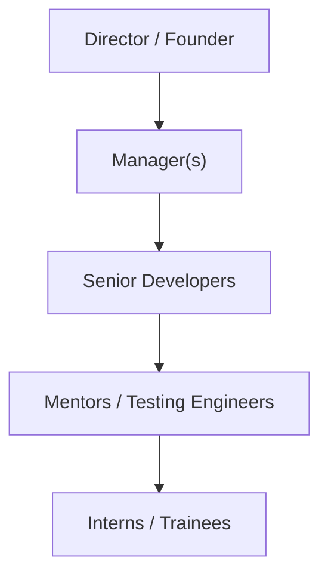

# CIE - I Presentation
## Company Profile: Rlogic Technologies
**Date:** [DD/MM/YYYY]

---

## 1. Overview of the Organization

**Rlogic Technologies**
- **Established:** 01/12/2020
- **Location:** Kudligi (Tq), Bellary (Dt)
- **Focus:** Bridging the gap between academic knowledge and industry application.
- **Specializations:** Hands-on training in AI-ML, Python, PCB, IoT, Embedded Systems, Web Development, and more.

---

## 2. Vision, Mission & Values

- **Vision:** Improve the quality of life through software products and social service activities, empowering individuals to use their skills meaningfully.

- **Mission:** Deliver quality products/services and build lasting trust with clients and society.

- **Values:** Transparency, ethics, and providing maximum value to clients.

---

## 3. Organization Structure

---

## 4. Roles and Responsibilities

- **Director:** Defines long-term strategies, MoUs, and ensures company vision is met.
- **Manager:** Resource allocation, project scheduling, and coordination.
- **Senior Developer:** Technical architecture and code/hardware quality.
- **Mentors & QA:** Guide hands-on sessions, clarify doubts, and test products.
- **Interns:** Apply academic knowledge to build industry-standard solutions.

---

## 5. Products and Services

**1. Hands-on Workshops & Training:**
- PCB Design & Fabrication
- IoT & Embedded Systems
- Web & Android Application Development
- AI-ML & VLSI System Design

**2. Corporate & Academic Solutions:**
- Internships & Placement Support
- Industrial Project Support
- Electronic Components Sourcing

---

## 6. Market Performance & Clientele

**Robust market presence with top-tier collaborations:**

- **Industrial Clients:** 
  TE Connectivity, Esses Electronics, Lighting Technologies, SFO Technologies, FCI.
  
- **Academic Clients:** 
  RYMEC (Ballari), PDIT (Hospet), NIT (Raichur), BIT (Davanagere), and many more across the region.

---

# Thank You!
**Any Questions?**
