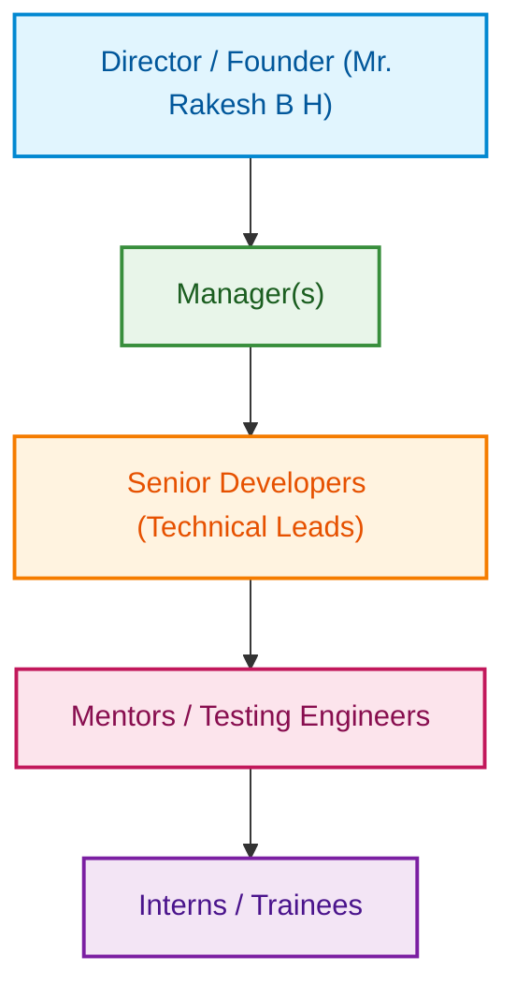

## Continuous Internal Evaluation- CIE - I conducted at the end of 4th week

| Sl No | Assessment parameter | Marks |
| :---: | :--- | :---: |
| 1 | Submit a report to the training supervisor and copy to the cohort owner focusing on:   • Overview of the organization • Vision and mission of the organization • Organization structure • Roles and Responsibilities of personnel in the organization • Products and market performance | 50 |
| 2 | Give a presentation on the above | 30 |
| | **Total** | **80** |

---

# CIE 1 Report

## 1. Overview of the Organization

**Entity:** Rlogic Technologies
- **Date of Establishment:** 01/12/2020
- **Corporate Headquarters:** #271, Shree Vasavi Building, New CSPura Extension, Near Govt School, Kudligi (Tq), Bellary (Dt) - 583 130
- **Official Portal:** www.rlogictechnologies.com
- **GST Identification Number:** 29BPXPB3720F1ZS

**Organizational Overview:**
Established on 01/12/2020, Rlogic Technologies is a distinguished technological enterprise structurally oriented around the convergence of theoretical academia and real-world industrial application. Founded with a profound pedagogical ideology, the organization operates under the paradigm that technical education transcends mere academic evaluation. Rather, the intrinsic value of engineering disciplines is rooted in the practical implementation and innovation of systematic ideas.

Rlogic Technologies specializes in facilitating comprehensive, hands-on industrial training programs, academic internships, and specialized corporate project support. The organization acts as a conduit for undergraduate and graduate engineers to acquire profound exposure to multifaceted, state-of-the-art technological domains. These specialized domains include Artificial Intelligence and Machine Learning (AI-ML), Python Programming paradigms, Printed Circuit Board (PCB) Architecture, Unmanned Aerial Vehicle (Drone) Technology, Internet of Things (IoT) Interfacing, Embedded Systems Design, Very Large-Scale Integration (VLSI), Industrial Automation, Robotics, as well as comprehensive Mobile and Web Application Development. The technological syllabi are rigorously formulated by seasoned industry professionals to ensure strict alignment with contemporary industrial demands and job-oriented proficiencies.

## 2. Vision and Mission of the Organization

**Organizational Vision:**
The principal vision of Rlogic Technologies is to systematically elevate the overall quality of human life by architecting innovative software products and engaging in substantial socio-centric technological activities. The founders vehemently advocate for an entrepreneurial ecosystem where intellectual autonomy enables individuals to leverage their technical proficiencies to positively impact society.

**Organizational Mission:**
The fundamental mission is to engineer and deliver unparalleled, high-quality technological products and services. Simultaneously, the organization strives to architect enduring, trust-based relationships with its diverse clientele and the broader societal community, functioning systematically as a catalyst for socio-economic and technological growth.

**Core Ethical Values:**
Rlogic Technologies strictly adheres to a robust ethical framework characterized by absolute operational transparency. The organization is fundamentally committed to yielding maximum qualitative and quantitative value for its clients, fostering a dynamic workspace where passion, enthusiasm, and meaningful creation supersede mere commercial profit.

## 3. Organization Structure

The hierarchical architecture of Rlogic Technologies is systematically designed to optimize project execution, streamline the delegation of technical responsibilities, and facilitate a conducive environment for hands-on experiential learning for its trainees. The delineated structure ensures a seamless dissemination of technical directives from the administrative apex tier to the execution tiers:

## 4. Roles and Responsibilities of Personnel

The systematic operational efficiency of the organization is contingent upon the specialized functionalities of its human resources. The well-defined responsibilities are articulated as follows:

*   **Director / Founder (Mr. Rakesh B H):** As the chief administrative authority, the Director is responsible for the macro-level strategic planning and overarching governance of the enterprise. Responsibilities include formulating long-term operational strategies, securing Memorandums of Understanding (MoUs) with industrial and academic entities, and ensuring the absolute alignment of organizational activities with its stated vision.
*   **Manager(s):** Acting as the critical interface between the administrative and technical domains, managers are tasked with the optimization of resource allocation. They meticulously orchestrate project schedules, guarantee cross-functional collaborations between diverse engineering departments, and preemptively resolve operational bottlenecks to ensure uninterrupted project lifecycles.
*   **Senior Developers (Technical Leads):** Functioning as the apex technical authorities, Technical Leads govern the architectural design and structural integrity of all technological deployments. They enforce strict adherence to coding and hardware standards, troubleshoot sophisticated anomalies, and facilitate advanced architectural orientations for subordinate engineering personnel.
*   **Mentors:** Mentors are instrumental in the pedagogical facet of the enterprise. They establish a synchronous rapport with interns, administering guided, hands-on instructional modules. They delegate practical deployment tasks and serve as the primary intellectual resource for elucidating complex technical paradigms.
*   **Testing Engineers / Quality Assurance (QA):** Operating within the verification and validation framework, QA personnel execute rigorous testing methodologies on both computational software and physical hardware prototypes. Their principal objective is to identify and rectify systemic vulnerabilities, computational bugs, or systemic inefficiencies prior to the commencement of end-user deployment.
*   **Interns / Trainees:** Positioned at the experiential acquisition tier, interns iteratively execute compartmentalized developmental modules. This tier bridges the intellectual chasm between academic theory and industrial praxis, dynamically contributing to sophisticated engineering solutions under stringent expert supervision.

## 5. Products and Market Performance

Rlogic Technologies maintains a prominent market trajectory, operating synergistically across both the Educational Technology (EdTech) sector and the specialized Industrial Solutions domain.

**Key Products and Service Domains:**
1.  **Experiential Workshops and Pedagogical Training:** The enterprise architects and executes high-fidelity technical training modules. Key domains encompass Printed Circuit Board (PCB) Design and Fabrication, Internet of Things (IoT) Architectures, Android Application Ecosystems, Industrial Automation and Robotics, Embedded Systems Interfacing, Artificial Intelligence and Machine Learning (AI-ML) Computational Models, VLSI System Synthesis, Unmanned Aerial Vehicle (Drone) Mechanisms, and comprehensive Full-Stack Web Development.
2.  **Corporate and Academic Solutions Frameworks:** The organization delivers robust corporate infrastructure solutions, facilitating academic and industrial project paradigms, structured placement orchestration, and specialized logistics encompassing electronic components sourcing and provisioning.

**Market Penetration and Collaborations:**
The corporate footprint is empirically validated through a formidable network of formalized Memorandums of Understanding (MoUs) with distinguished industrial corporates and academic campuses. 

*   **Paramount Industrial Collaborations:** TE Connectivity, Esses Electronics, Lighting Technologies, SFO Technologies, FCI, and Amphenol.
*   **Prominent Academic Collaborations:** RYMEC (Ballari), PDIT (Hospet), NIT (Raichur), SMV (Raichur), BIT (Davanagere), GMIT (Davanagere), TCE (Gadag), CIT (Madikeri), SJBIT (Chitradurga), JSPM (Pune), and SECAB (Vijayapura).

This pervasive and diverse integration across both intellectual establishments and corporate enterprises substantiates Rlogic Technologies' profound credibility, highlighting a consistently ascendant market performance driven by uncompromising technological excellence.
