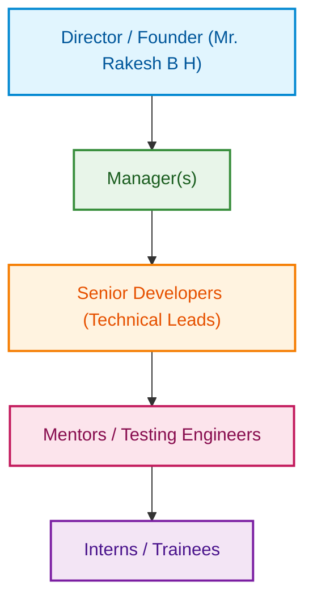

## Continuous Internal Evaluation- CIE - I conducted at the end of 4th week

| Sl No | Assessment parameter | Marks |
| :---: | :--- | :---: |
| 1 | Submit a report to the training supervisor and copy to the cohort owner focusing on:   • Overview of the organization • Vision and mission of the organization • Organization structure • Roles and Responsibilities of personnel in the organization • Products and market performance | 50 |
| 2 | Give a presentation on the above | 30 |
| | **Total** | **80** |

---

# CIE 1 Report

## 1. Overview of the Organization
**Rlogic Technologies**
- **Established:** 01/12/2020
- **Location:** #271, Shree Vasavi Building, New CSPura Extension, Near Govt School, Kudligi (Tq), Bellary (Dt) - 583 130
- **Website:** www.rlogictechnologies.com
- **GST No:** 29BPXPB3720F1ZS

**About the Company:**
Rlogic Technologies is a reputed technology organization dedicated to bridging the gap between academic knowledge and industry application. The company specializes in providing hands-on training sessions, industrial project support, and internships in cutting-edge technologies like AI-ML, Python, PCB, Drones, IoT, Embedded Systems, VLSI, Automation, Robotics, Mobile App, and Web Development. Their core philosophy focuses on the practical application of ideas rather than just theoretical education.

## 2. Vision and Mission of the Organization

**Vision:**
To help improve the quality of life of people through our software products and social service activities, while enabling individuals to work towards making this world a better place through their skills.

**Mission:**
To deliver quality products and services and to build trust and good relationships with clients and society.

**Values:** 
To stick to ethics of being transparent and provide maximum value to our clients.

## 3. Organization Structure

The structural hierarchy at Rlogic Technologies is designed to promote efficient development, hands-on learning, and successful project delivery:

## 4. Roles and Responsibilities of Personnel

*   **Director:** Oversees the overall functioning of the organization, defines long-term strategies, handles industry MoUs, and ensures the core vision of the company is met.
*   **Manager:** Allocates resources, manages task schedules, coordinates between different technological departments, and ensures projects run smoothly without bottlenecks.
*   **Senior Developer (Technical Lead):** Leads the technical aspect of the development, ensures code/hardware quality, helps resolve complex errors, and conducts practical architecture sessions.
*   **Mentors:** Work closely with interns and trainees. They guide coding and hands-on sessions, assign practical tasks (e.g., PCB fabrication, IoT integration, or Web page building), and proactively clarify technical doubts.
*   **Testing Engineers / QA:** Responsible for checking the software or hardware for bugs/errors before deploying those solutions to the end-users.
*   **Interns:** Work through assigned tasks quickly on small project parts or in groups, applying their academic knowledge to build working, industry-standard solutions.

## 5. Products and Market Performance

Rlogic Technologies operates primarily in both the EdTech sector and Industrial solutions domain, boasting a robust market performance with numerous clients.

**Key Products & Services:**
1.  **Hands-on Workshops & Training:** Emphasizing PCB Design & Fabrication, IoT, Android Application Development, Automation & Robotics, Embedded Systems, AI-ML, VLSI System Design, Drone Applications, and Web Development.
2.  **Corporate & Academic Solutions:** Internships & Placement Support, Academic & Industrial Project Support, and Electronic Components Sourcing.

**Market Performance & Clientele:**
The organization has established a strong market footprint by signing MoUs and collaborating with top-tier clients and academic institutions, which indicates a highly trusted and robust market presence.

*   **Industrial Clients:** TE Connectivity, Esses Electronics, Lighting Technologies, SFO Technologies, FCI, Amphenol.
*   **Academic Clients:** RYMEC (Ballari), PDIT (Hospet), NIT (Raichur), SMV (Raichur), BIT (Davanagere), GMIT (Davanagere), TCE (Gadag), CIT (Madikeri), SJBIT (Chitradurga), JSPM (Pune), and SECAB (Vijayapura).

This widespread clientele emphasizes their strong credibility in providing impactful technological services and continuous growth in their specific market niches.
