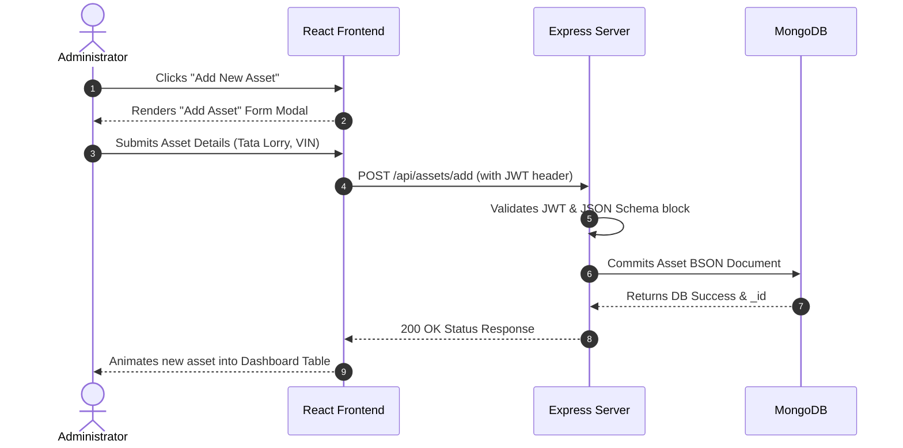

## Continuous Internal Evaluation- CIE - II conducted at the end of 8th week

| Sl No | Assessment of On Job Training (OJT)-1 + use case 1 | Marks |
| :---: | :--- | :---: |
| 1 | Select any one job role of his/her interest in an organization or role assigned by the training supervisor for next Four weeks and submit a report to the training supervisor and copy to cohort owner focusing on:  1. Intern's ability to apply the skill and technical knowledge on OJT-1 2. Intern's performance on assigned tasks and project 3. Extent of Intern's ability to add value to the organization through internship | 50 |
| 2 | Document a Use case on a task where he is working as intern | 30 |
| | **Total** | **80** |

**Note:**
1. CIE-II shall be assessed by the Industrial Training Supervisor using companies' assessment Tools/Rubrics
2. Cohort owner shall assist the Industrial Training Supervisor during assessment of CIE-II

---

# CIE 2 Report

**Job Role Assigned:** Full Stack Web Developer Intern  
**Project Allocated:** Web-Based Asset Tracker  
**Organization:** Rlogic Technologies  
## 1. Intern's Ability to Apply Skill and Technical Knowledge on OJT-1

During the On Job Training (OJT-1), I successfully transitioned from theoretical concepts to practical, industry-standard development by architecting a comprehensive **Web-Based Asset Tracker**. This project rigorously tested my capabilities in deploying modern web frameworks and managing distributed system logic. The detailed application of my technical skills includes:

*   **Advanced Frontend Development:** 
    *   **React.js & Component Modularity:** Deployed React hooks (`useState`, `useEffect`, `useContext`) to construct a globally accessible state management system, preventing redundant network calls. Designed reusable components like `<AssetCard />` and `<DataTable />` to keep the codebase DRY (Don't Repeat Yourself).
    *   **Responsive UI/UX via Tailwind CSS:** Translated raw wireframes into polished interfaces. Used Tailwind's utility-first approach to create adaptive grid layouts that fluidly adjust from small mobile screens to large desktop monitors, prioritizing accessibility and modern aesthetics.
*   **Robust Backend Architecture:** 
    *   **Node.js & Express.js:** Built a RESTful API architecture from the ground up. Engineered highly specific endpoints (e.g., `POST /api/assets/add`, `GET /api/assets/inventory`) manipulating HTTP protocols efficiently.
    *   **Custom Middleware & Security:** Programmed custom middleware functions within Express to validate JSON payloads prior to database insertion, thwarting potential code injection attacks.
*   **Scalable Database Engineering:** 
    *   **MongoDB & Mongoose:** Designed a flexible, document-oriented NoSQL database schema using Mongoose ORM. Created strict models for `Users`, `Assets`, and `Departments`, enforcing data relationships and validation logic (e.g., ensuring a commercial vehicle asset requires an RTO Registration Number, or a real estate property requires a Khata/Survey Number).
*   **API Testing & Validation:**
    *   **Postman Optimization:** Developed comprehensive Postman collections to simulate heavy data loads and test API endpoint integrity, ensuring proper handling of `400 Bad Request`, `401 Unauthorized`, and `200 OK` status codes under various failure conditions.

## 2. Intern's Performance on Assigned Tasks and Project

My performance was strictly aligned with the agile software development lifecycle methodologies taught at Rlogic Technologies. My designated responsibilities on the Asset Tracker project were executed with high precision:

*   **Phase 1 - Requirement Analysis & System Design:** 
    *   Successfully translated abstract problem statements into actionable technical wireframes.
    *   Developed extensive UML documentation, including Use Case Diagrams, Data Flow Diagrams (Level 0), and Entity-Relationship maps to solidify the application's skeletal framework before writing code.
*   **Phase 2 - Database Integration & Server Engineering:** 
    *   Constructed the central MongoDB cluster and linked it securely to the Node server using environment variables (`.env`) to protect database URI strings.
    *   Programmed core CRUD operations ensuring administrators could safely manipulate the asset lifecycle.
*   **Phase 3 - Client-Server Integration & State Synchronization:** 
    *   Connected the MongoDB backend seamlessly with the React frontend through Axios fetching.
    *   Implemented optimistic UI updates, ensuring that when an asset is deleted or updated, the change reflects instantaneously on the browser without necessitating a hard page reload, dramatically improving user experience.
*   **Phase 4 - Authentication & Access Control:** 
    *   Engineered a flawless security infrastructure using **JWT (JSON Web Tokens)** and **Bcrypt.js** password hashing. Designed role-based rendering so standard employees only view assets while administrators gain full mutation privileges.

## 3. Extent of Intern's Ability to Add Value to the Organization Through Internship

The complete conceptualization and deployment of the Asset Tracker provided profound organizational value, transforming legacy administrative workflows into a unified digital ecosystem:

*   **Maximized Operational Efficiency:** Completely eradicated the reliance on error-prone, fragmented physical ledgers and disjointed Excel files. This transition reduced administrative auditing time dramatically, granting IT managers split-second retrieval of an asset's entire history.
*   **Uncompromising Data Integrity & Security:** By enforcing role-based accountability tracking ("who assigned what to whom"), the system drastically minimized arbitrary data manipulation. Corrupted data caused by duplicate spreadsheet files was eliminated.
*   **Modernization & Cost Reduction:** Delivered a high-performance, real-time application scalable for long-term organizational growth. By utilizing the open-source MERN stack, I provided a highly capable tracking tool with zero recurring enterprise licensing fees, showcasing a viable path for internal software development.

---

## 2. Document a Use case on a task where he is working as intern

**Use Case Title:** Complete Lifecycle Management of Adding a New Asset  
**Primary Actor:** Administrator / IT Manager  
**Secondary Actor:** Backend MongoDB Database  
**Goal:** Ingest a newly procured high-value organizational asset (e.g., Real Estate properties like an Industrial Godown, or heavy Commercial Vehicles like a Tata Signa Lorry) into the secure digital tracker seamlessly and associate it with the correct operational department.

**Pre-conditions:**
1. The Administrator possesses a valid account with `ADMIN` privileges securely stored in the database.
2. The Administrator is actively logged into the Web-Based Asset Tracker system via valid JWT authentication.
3. The target Department (e.g., "Logistics & Supply Chain") already exists within the system metadata.

**Use Case Sequence Diagram:**

**Main Success Scenario (Flow of Events):**
1. **Initiation:** The Administrator navigates to the core "Asset Management" dashboard within the application workspace.
2. **Action Trigger:** The Administrator clicks the prominent "+ Add New Asset" CTA button located at the top right of the dashboard.
3. **Form Rendering:** The React frontend captures the click event and mounts an interactive "Add Asset" pop-up modal overlay without routing away from the current page.
4. **Data Input:** The Administrator completes the required form fields: 
   *   `asset_name`: "Tata Signa 2825.K Tipper Lorry"
   *   `rto_registration_no`: "KA-34-G-4589" (Ballari RTO)
   *   `status`: "Active (On Road - Transporting)"
   *   `assigned_department`: "Logistics & Supply Chain"
5. **Submission:** The Administrator verifies the typed information and clicks "Submit".
6. **Network Transport:** The React client serializes the data into a JSON object and formulates an asynchronous HTTP POST request to the Express.js server API endpoint (`/api/assets/add`). The client injects the Administrator's JWT token into the `Authorization` header.
7. **Server-Side Validation:** The Express server intercepts the request. The authentication middleware validates the JWT to confirm admin access. The schema middleware validates the JSON structure against the requested Mongoose schema.
8. **Database Commit:** Upon successful validation, the server instructs the MongoDB driver to commit the new document into the `ASSETS` collection.
9. **Server Response:** MongoDB returns the unique `_id` of the created document to Express. Express formats a `200 OK` HTTP response containing a success descriptor and sends it back to the client.
10. **UI Hydration:** The React application receives the `200 OK` response. It automatically updates the local React state, unmounts the modal, and renders a floating "Success" toast notification. The newly created "Tata Signa 2825.K Tipper Lorry" gracefully animates into the top row of the live tracking table.

**Alternate Flows (Exceptions):**
*   ***Invalid Input (Step 7):* ** If the Administrator forgets the mandatory `rto_registration_no`, the Express server rejects the payload, responding with a `400 Bad Request`. The React frontend catches this error and highlights the missing form field in red, prompting the user for correction.
*   ***Session Expiration (Step 7):*** If the Administrator's JWT token has expired (e.g., left the browser open overnight), the server responds with a `401 Unauthorized`. The frontend forces the user to the log-in screen securely.

**Post-conditions:**
*   The Tata Signa 2825.K Tipper Lorry is permanently recorded with a tamper-proof timestamp.
*   The high-value asset is globally searchable by any authenticated employee accessing the system.
