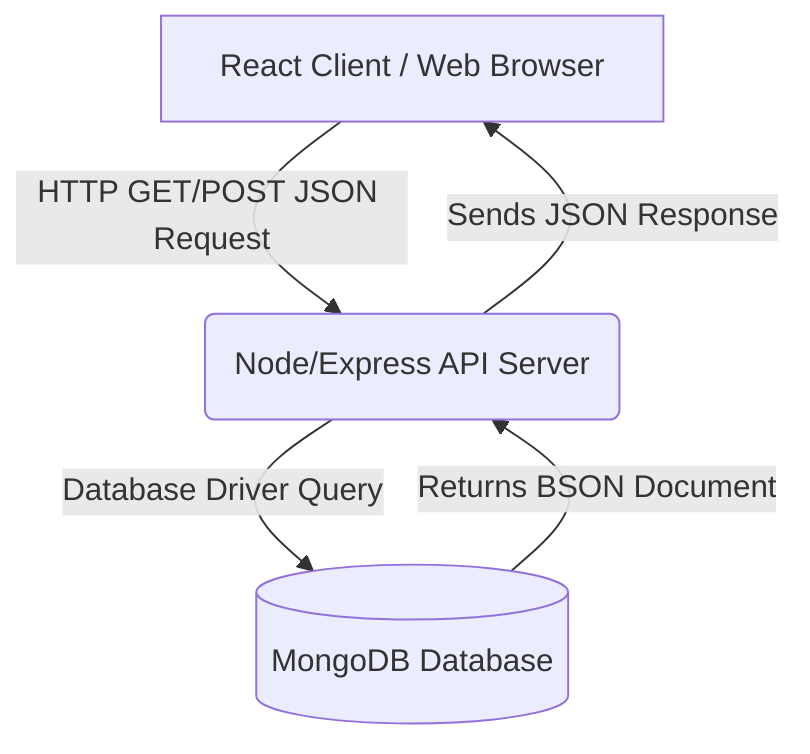
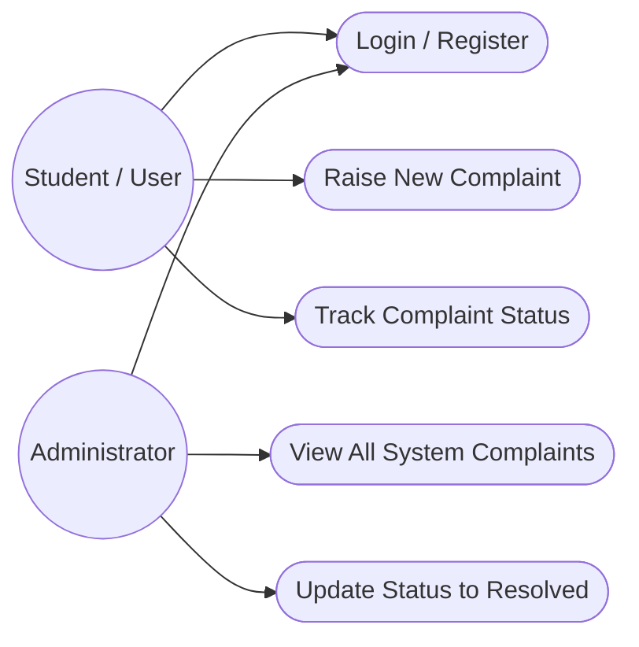
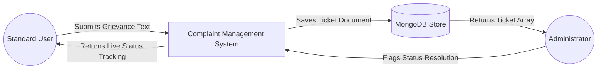
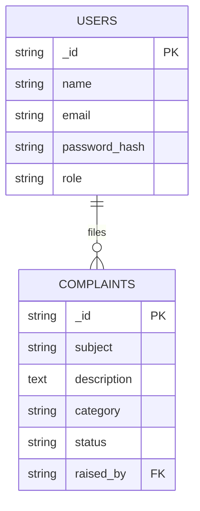

# ABSTRACT

This mini-project report details the design, development, and implementation of an **Online Complaint Management System**, developed during my Full Stack Web Development internship at **temp_company**. Undertaken as a partial fulfillment of the UG Diploma, this project demonstrates the practical application of modern web technologies, specifically the **MERN Stack** (MongoDB, Express.js, React.js, and Node.js).

Traditionally, organizations rely on physical suggestion boxes or convoluted paper chains to manage internal grievances, leading to lost forms, poor accountability, and slow resolution times. The objective of this project was to establish a centralized digital portal where active users can securely raise complaints and track real-time resolution statuses while administrators can effectively triage and manage them.

The system features an interactive ticketing dashboard, role-based authentication separating standard users from admins, and a complete CRUD capability for grievance logging. Structured methodologies—ranging from requirement gathering and UI component design to backend API creation and database normalization—were deployed throughout the development lifecycle.

Ultimately, this project highlights a successful transition from theoretical academic knowledge to constructing robust, scalable, and responsive web applications in a real-world setting.

# TABLE OF CONTENTS

| SL. No. | Title | Page No. |
| :---: | :--- | :---: |
| | Abstract | 1 |
| **1** | **INTRODUCTION** | **3** |
| 1.1 | Project Overview | 3 |
| 1.2 | Problem Statement & Existing System | 3 |
| 1.3 | Proposed System & Objectives | 4 |
| 1.4 | Advantages of Proposed System | 4 |
| **2** | **SYSTEM REQUIREMENTS & TECHNOLOGIES** | **5** |
| 2.1 | Hardware Requirements | 5 |
| 2.2 | Software Requirements | 5 |
| 2.3 | Technologies Used | 6 |
| **3** | **SYSTEM DESIGN AND ARCHITECTURE** | **7** |
| 3.1 | System Architecture | 7 |
| 3.2 | Use Case Diagram | 8 |
| 3.3 | Data Flow Diagram | 8 |
| 3.4 | Entity Relationship (ER) Diagram | 9 |
| **4** | **IMPLEMENTATION METHODOLOGY** | **10** |
| 4.1 | Planning and Requirement Analysis | 10 |
| 4.2 | Database and API Design | 10 |
| 4.3 | UI Development | 11 |
| 4.4 | Testing & Deployment | 11 |
| **5** | **CONCLUSION AND FUTURE SCOPE** | **12** |
| 5.1 | Conclusion | 12 |
| 5.2 | Future Enhancements | 12 |
| | **REFERENCES** | **13** |

# CHAPTER 1: INTRODUCTION

## 1.1 Project Overview
The **Online Complaint Management System** is a comprehensive web-based platform built to help institutions formally digitalize their grievance handling channels. Engineered using the MERN stack, the application serves as a dedicated portal allowing stakeholders to submit structured complaint tickets encompassing categories like 'Infrastructure', 'IT Support', and 'Administrative'.

This mini-project was the culmination of my training period at **temp_company**, where I was tasked with bridging the gap between front-end UI design and back-end structural database connections. The outcome introduces high accountability metrics directly mapping complaint statuses ('Open', 'In Progress', 'Resolved') natively on a centralized dashboard.

## 1.2 Problem Statement & Existing System
A prevailing issue in mid-scale operations or collegiate institutions revolves around complaint processing. Standard procedures heavily rely on obsolete physical drop-boxes or unstructured email chains, leading to inherent bottlenecks:
*   Inability to confirm if a formal complaint has been acknowledged by higher authorities.
*   Loss of paper trails directly stifling analytical review of frequent departmental failures.
*   Lack of systematic prioritization or categorized sorting.

The existing framework demands administrators physically catalog complaints, track down relevant department heads manually, and coordinate back to the victim blindly without automated status updates.

## 1.3 Proposed System & Objectives
The proposed logic actively transitions the burden from archaic methodologies to the browser via a **Three-Tier Architecture** interacting through secure web APIs (Express.js) fetching structured data (MongoDB) directly pushing into dynamic visual lists on an interface (React.js).

The primary objectives include:
1.  **Centralization**: Generate a single point of truth for tracking incoming grievances transparently.
2.  **Role Segmentation**: Implement multi-tier login verification isolating what a student/user sees versus robust admin overriding privileges.
3.  **Status Transparency**: Develop interfaces to automatically update users internally eliminating endless follow-ups.
4.  **Database Scalability**: Store intricate textual descriptions categorically in an optimized NoSQL database.

## 1.4 Advantages of Proposed System
*   **High Performance Triage**: Dynamic React rendering allows admins to massively sort "High Priority" items without requesting full page reloads.
*   **Authentication Validation**: JWT (JSON Web Tokens) perfectly masks user identities keeping specific complaint origins strictly private where needed.
*   **Data Integrity**: Controlled dropdown formatting forces users to lodge tickets categorically preventing mismatched data.
*   **Responsive Layout**: Utilizing Tailwind CSS essentially guarantees users facing immediate issues can snap their smartphone open and raise logs easily.

# CHAPTER 2: SYSTEM REQUIREMENTS & TECHNOLOGIES

Structuring the appropriate minimum viable configurations required to maintain up-time accurately.

## 2.1 Hardware Requirements
The minimum hardware necessary for running both the server and client-side applications smoothly:

| Category | Requirement Specification |
| :--- | :--- |
| **Processor** | Intel Core i3 / AMD Ryzen 3 or higher |
| **Memory (RAM)** | 4 GB (8 GB highly recommended to run modern editors and browsers) |
| **Hard Disk** | Minimum 256 GB SSD (for fast local read/write) |
| **Monitor Resolution** | Minimum 1366x768 pixels |

## 2.2 Software Requirements
The tools and operating frameworks utilized to construct this project:

| Category | Requirement Specification |
| :--- | :--- |
| **Operating System** | Windows 10/11, macOS, or Linux |
| **Code Editor** | Visual Studio Code (VS Code) |
| **Web Browser** | Google Chrome or Mozilla Firefox |
| **Runtime Environment** | Node.js (v16 or higher) |
| **Database Management**| MongoDB Compass |
| **API Testing** | Postman |

## 2.3 Technologies Used

Modern solutions require modern frameworks. This architecture implements **MERN**.

*   **HTML & CSS (Tailwind)**: HTML handles the structural hierarchy, significantly bolstered by Tailwind CSS which controls complex margin, padding, and flex alignments directly within class names for accelerated layouts.
*   **JavaScript (ES6+)**: Handles frontend state logic handling heavy form submissions proactively.
*   **React.js**: Progressively maps URL parameters into explicit isolated components avoiding heavy rendering lags entirely using partial DOM updating tricks underneath.
*   **Node.js & Express.js**: Node handles async scaling capabilities seamlessly hosting the Express routing framework. The API actively manages complex multi-stage JSON payload manipulations to and from the database natively.
*   **MongoDB**: An advanced document-oriented NoSQL database perfect for text-heavy data structures intrinsic to complaint descriptions formatting them into highly scalable BSON collections visually.

# CHAPTER 3: SYSTEM DESIGN AND ARCHITECTURE

Designing the flow of information before writing code was emphasized throughout the internship.

## 3.1 System Architecture

The application implements a classic client-server logic over HTTP.

## 3.2 Use Case Diagram
The Use Case diagram below dictates varying capabilities based on the user's role. This implementation was a core assignment during the internship training program.

## 3.3 Data Flow Diagram (DFD Level 0)

General pathways depicting how form texts interact completely with the administrative database node.

## 3.4 Entity Relationship (ER) Diagram

A representation mapping registered users natively interacting with distinct complaint tickets dynamically.

# CHAPTER 4: IMPLEMENTATION METHODOLOGY

Deploying logic followed structured temp_company methodology perfectly phased.

## 4.1 Planning and Requirement Analysis
*   **Scope Definition**: Determined absolute boundaries establishing what a 'Student' natively sees relative only to their internal tickets vs 'Admins' accessing universal tables.
*   **Wireframing**: Sketches dictated the navigational sidebar housing immediate metrics like "Open Tickets" counting cleanly up top for administrative review speed.

## 4.2 Database and API Design
*   **Schema Creation**: MongoDB models required establishing flexible text properties anchoring `status` limits via strict schema verifications ('Open', 'Pending', 'Closed'). 
*   **API Endpoints Development**:
    *   `POST /api/auth/register` (Establishing internal accounts securely)
    *   `POST /api/complaints/new` (Inserting newly raised forms safely)
    *   `PUT /api/complaints/:id/status` (Allowing admins to upgrade ticket milestones)
*   **Middleware Implementation**: Authorization constraints securely bypassed specific routes denying non-admin tokens from altering operational status logic blocks.

## 4.3 UI Development
*   **React Initialization**: Leveraging React Router mapped explicit boundaries creating the `/admin/dashboard` independently from `/user/tickets`.
*   **Global State (Context API)**: Context was applied ensuring localized auth identities remained persistent circumventing continuous API polling loops endlessly identifying user permissions. 
*   **Tailwind Styling**: Clean modal popups were heavily integrated avoiding accidental closures handling long lengthy text inputs effectively ensuring mobile keyboards interacted correctly.

## 4.4 Testing & Deployment
*   **Unit and Endpoint Testing**: Postman acted as the primary gateway attempting forceful token hacks returning highly correct `401 Unauthorized` blocks safeguarding the MongoDB core. 
*   **Responsiveness Checks**: Chrome developer inspection accurately validated intricate sidebars wrapping intelligently below main grid boards on mobile pixel dimension constraints.

# CHAPTER 5: CONCLUSION AND FUTURE SCOPE

## 5.1 Conclusion
The full development lifecycle establishing the **Online Complaint Management System** firmly verified academic principles transitioning beautifully into tangible dynamic web projects securely. Harnessing structured relational tracking using a NoSQL DB effectively mapped exactly how real-world scale works logically. 

Shifting away from obsolete methodologies toward agile interconnected role-based dashboards natively highlighted precisely why the MERN framework thrives regarding scalable UI development and instantaneous network routing logic capabilities. 

## 5.2 Future Enhancements
Prospective additions enabling better future scalability:
1.  **Direct Media Attachments**: Modifying schemas permitting users to natively upload smartphone pictures detailing exact physical infrastructure breakdowns connecting into cloud buckets (AWS/Cloudinary).
2.  **Automated Email Chains**: Triggering backend server scripts sending exact timestamped emails inherently pinging all parties instantly when backend milestones physically pivot to 'Resolved'.
3.  **Live Chat Connectivity**: Incorporating WebSockets (Socket.io) handling immediate real-time chat instances explicitly connected inside active tickets themselves clarifying problems dynamically.

# REFERENCES

1.  **MDN Web Docs (Mozilla Developer Network)**. *HTML, CSS, and JavaScript Documentation*. Available at: https://developer.mozilla.org/
2.  **React Documentation**, Meta Platforms, Inc. *React – A JavaScript library for building user interfaces*. Available at: https://react.dev/
3.  **Tailwind CSS Documentation**, Tailwind Labs. *A utility-first CSS framework for rapid UI development*. Available at: https://tailwindcss.com/
4.  **Node.js Documentation**, OpenJS Foundation. *Node.js v18.x Documentation*. Available at: https://nodejs.org/docs/
5.  **MongoDB Manual**, MongoDB, Inc. *The MongoDB Database Documentation*. Available at: https://www.mongodb.com/docs/manual/
6.  **Express.js API Reference**,  *Fast, unopinionated web framework for Node.js*. Available at: https://expressjs.com/

    
*(End of Report)*
