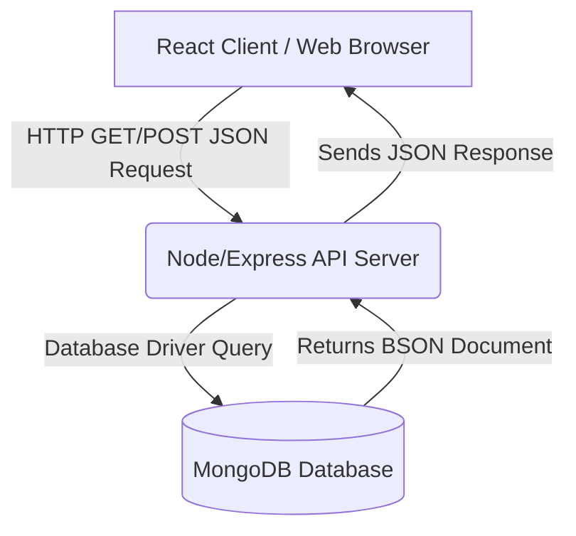
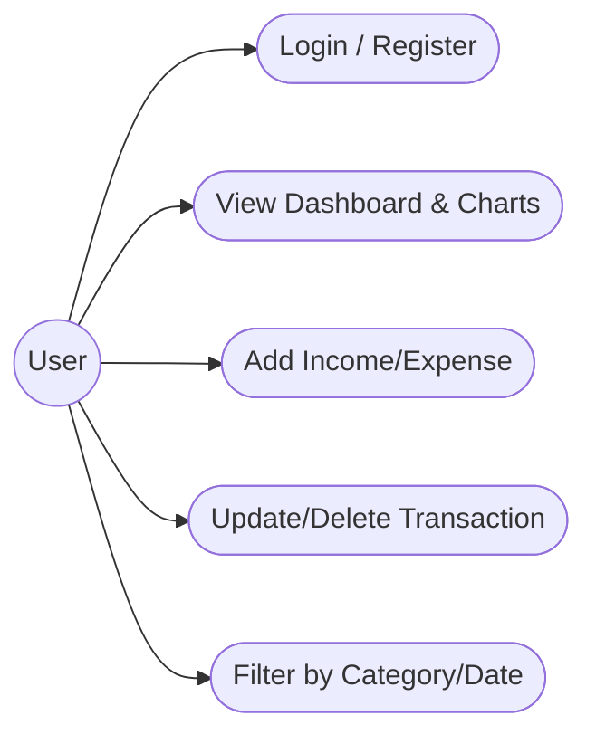
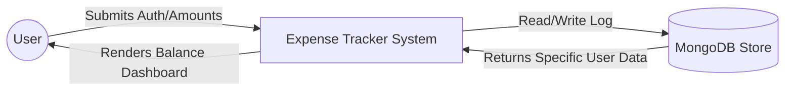
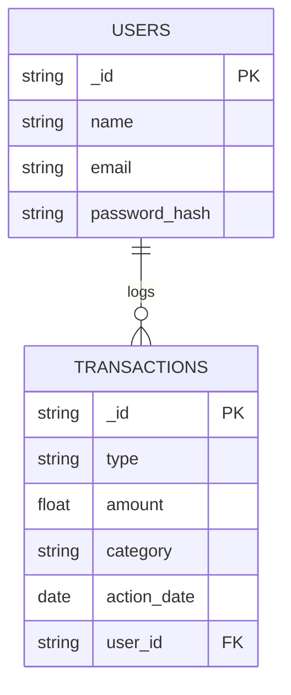

# ABSTRACT

This mini-project report details the design, development, and implementation of an **Expense Tracker Web Application**, developed during my Full Stack Web Development internship at **temp_company**. Undertaken as a partial fulfillment of the UG Diploma, this project demonstrates the practical application of modern web technologies, specifically the **MERN Stack** (MongoDB, Express.js, React.js, and Node.js).

Traditionally, individuals and small businesses rely on manual diaries or disjointed spreadsheets to track their finances, leading to miscalculations, poor budget-awareness, and difficulty in analyzing spending habits. The objective of this project was to establish a centralized digital solution where users can categorize, log, and visualize their daily incomes and expenses.

The system features an interactive dashboard with dynamic charts, secure user authentication, and a complete CRUD capability for managing financial transactions. Structured methodologies—ranging from requirement gathering and UI component design to backend API creation and database normalization—were deployed throughout the development lifecycle.

Ultimately, this project highlights a successful transition from theoretical academic knowledge to constructing robust, scalable, and responsive web applications in a real-world setting.

# TABLE OF CONTENTS

| SL. No. | Title | Page No. |
| :---: | :--- | :---: |
| | Abstract | 1 |
| **1** | **INTRODUCTION** | **3** |
| 1.1 | Project Overview | 3 |
| 1.2 | Problem Statement & Existing System | 3 |
| 1.3 | Proposed System & Objectives | 4 |
| 1.4 | Advantages of Proposed System | 4 |
| **2** | **SYSTEM REQUIREMENTS & TECHNOLOGIES** | **5** |
| 2.1 | Hardware Requirements | 5 |
| 2.2 | Software Requirements | 5 |
| 2.3 | Technologies Used | 6 |
| **3** | **SYSTEM DESIGN AND ARCHITECTURE** | **7** |
| 3.1 | System Architecture | 7 |
| 3.2 | Use Case Diagram | 8 |
| 3.3 | Data Flow Diagram | 8 |
| 3.4 | Entity Relationship (ER) Diagram | 9 |
| **4** | **IMPLEMENTATION METHODOLOGY** | **10** |
| 4.1 | Planning and Requirement Analysis | 10 |
| 4.2 | Database and API Design | 10 |
| 4.3 | UI Development | 11 |
| 4.4 | Testing & Deployment | 11 |
| **5** | **CONCLUSION AND FUTURE SCOPE** | **12** |
| 5.1 | Conclusion | 12 |
| 5.2 | Future Enhancements | 12 |
| | **REFERENCES** | **13** |

# CHAPTER 1: INTRODUCTION

## 1.1 Project Overview
The **Expense Tracker Web Application** is designed to help users monitor, manage, and analyze their daily financial cash flows effectively. Built dynamically using the MERN stack, the application serves as a personal finance assistant where users can log incomes, categorize expenses, and visualize their spending habits via interactive charts.

This mini-project was the culmination of my training period at **temp_company**, where I was tasked with bridging the gap between front-end UI design and back-end database engineering. The system provides immediate financial insights, thereby helping users maintain their monthly budgets effortlessly.

## 1.2 Problem Statement & Existing System
A significant portion of individuals and small setups manage personal budgeting using manual ledgers or basic Excel spreadsheets. As financial transactions multiply, users face notable challenges:
*   Difficulty in manually calculating categorized totals (e.g., Food vs. Travel).
*   Data loss probability if a physical diary or local file goes missing.
*   Lack of visual insight revealing where exactly the money is going each month.

The existing process normally relies on memory or sorting through hundreds of disorganized receipts. The existing model requires users to manually balance their accounts at the end of the month, which is highly error-prone.

## 1.3 Proposed System & Objectives
The proposed Expense Tracker system completely mitigates these flaws by taking operations to the browser. The new application utilizes a **Three-Tier Architecture** via secure web APIs (Express.js) that communicate seamlessly with a live database (MongoDB) and provide a rich user interface (React.js).

The primary objectives include:
1.  **Automation**: Create an engine that calculates current balances instantly upon new transaction entries.
2.  **Authentication & Security**: Ensure that financial data is strictly private and tied individually to the logged-in user credential.
3.  **Visualization**: Develop a responsive dashboard utilizing React.js to render pie-charts and bar-graphs tracking monthly spending habits.
4.  **Database Scalability**: Store intricate transaction histories in a scalable NoSQL database.

## 1.4 Advantages of Proposed System
*   **High Performance Analytics**: Dynamic component rendering allows users to filter transactions by date or category instantly.
*   **Authentication Validation**: JWT (JSON Web Tokens) are implemented to confirm that sensitive financial data is heavily protected.
*   **Data Integrity**: Form submissions restrict negative or invalid numeric inputs, keeping financial calculations mathematically accurate.
*   **Responsive Layout**: Utilizing Tailwind CSS ensures the tracker can be effortlessly accessed across desktops and mobile phones on the go.

# CHAPTER 2: SYSTEM REQUIREMENTS & TECHNOLOGIES

Identifying technical requirements is crucial for ensuring the project runs flawlessly. This chapter outlines the software/hardware needs and the MERN technical stack.

## 2.1 Hardware Requirements
The minimum hardware necessary for running both the server and client-side applications smoothly:

| Category | Requirement Specification |
| :--- | :--- |
| **Processor** | Intel Core i3 / AMD Ryzen 3 or higher |
| **Memory (RAM)** | 4 GB (8 GB highly recommended to run modern editors and browsers) |
| **Hard Disk** | Minimum 256 GB SSD (for fast local read/write) |
| **Monitor Resolution** | Minimum 1366x768 pixels |

## 2.2 Software Requirements
The tools and operating frameworks utilized to construct this project:

| Category | Requirement Specification |
| :--- | :--- |
| **Operating System** | Windows 10/11, macOS, or Linux |
| **Code Editor** | Visual Studio Code (VS Code) |
| **Web Browser** | Google Chrome or Mozilla Firefox |
| **Runtime Environment** | Node.js (v16 or higher) |
| **Database Management**| MongoDB Compass |
| **API Testing** | Postman |

## 2.3 Technologies Used

This project is firmly grounded in the **MERN** architecture.

*   **HTML & CSS (Tailwind)**: HTML scaffolds the core view, while Tailwind CSS handles utility-first rapid styling.
*   **JavaScript (ES6+)**: Handles frontend state logic, numerical calculations, and asynchronous API calls.
*   **React.js**: Allows building the interactive dashboard into reusable isolated components (e.g., `TransactionRow`, `BalanceCard`).
*   **Node.js & Express.js**: Node acts as the agile server-side runtime, while Express efficiently processes JSON routes managing the heavy logic behind calculating totals and grouping transactions cleanly.
*   **MongoDB**: An advanced document-oriented NoSQL database that perfectly accommodates the varied JSON structures required for categorized financial entries.

# CHAPTER 3: SYSTEM DESIGN AND ARCHITECTURE

Designing the flow of information before writing code was emphasized throughout the internship.

## 3.1 System Architecture

The application implements a classic client-server logic over HTTP.

## 3.2 Use Case Diagram
The Use Case diagram below dictates user capabilities. This implementation was a core assignment during the internship training program.

## 3.3 Data Flow Diagram (DFD Level 0)

The general data pipeline demonstrates how transaction inputs transform into visible dashboard reports.

## 3.4 Entity Relationship (ER) Diagram

A representation of the database links. Transactions belong specifically to registered users.

# CHAPTER 4: IMPLEMENTATION METHODOLOGY

Following structured processes learned at temp_company, development was handled in phases.

## 4.1 Planning and Requirement Analysis
*   **Scope Definition**: Goal established to remove manual logging and implement digital budgeting constraints with charting features.
*   **Wireframing**: Designing exactly where the pie-chart, overall balance widget, and tabular transaction list will neatly fit on a user's screen.

## 4.2 Database and API Design
*   **Schema Creation**: MongoDB models required `User` (for authentication) and `Transaction` (type string 'income' or 'expense', strict numeric amounts, and date constraints).
*   **API Endpoints Development**:
    *   `POST /api/auth/login` (Auth validation using bcrypt & JWT)
    *   `GET /api/transactions` (Fetch categorized history)
    *   `POST /api/transactions/new` (Record a new expense)
*   **Middleware Implementation**: Authorization constraints ensured users could only ever fetch data tied identically to their own User ID.

## 4.3 UI Development
*   **React Initialization**: Mapped critical URL boundaries securely (e.g., stopping non-logged-in users from viewing `/dashboard`).
*   **Global State (Context API)**: Avoided prop-drilling by storing the current net-balance globally so the header and dashboard both automatically knew total bounds.
*   **Charting Library**: Integrated dynamic visual plotting modules (like Chart.js/Recharts) to natively map API response datasets into visual pie slices.

## 4.4 Testing & Deployment
*   **Unit and Endpoint Testing**: Postman validated security headers. Invalid inputs (like strings injected into `amount` keys) were actively caught returning `400 Bad Request`.
*   **Responsiveness Checks**: Mobile layouts were heavily inspected; tables correctly overflow horizontally rather than breaking screen boundaries.

# CHAPTER 5: CONCLUSION AND FUTURE SCOPE

## 5.1 Conclusion
Developing the **Expense Tracker Web Application** proved phenomenal in mastering state management mathematically using React. Applying logical restrictions to calculating totals over datasets established a robust foundation for backend querying. 

Transitioning from manual tracking to a highly dynamic, database-driven analytical tool demonstrates the incredible capability of the MERN stack. The internship process guided everything securely from password hashing to JSON interactions, resulting in a project with high real-world applicability and utility.

## 5.2 Future Enhancements
Prospective modifications to evolve the application gracefully:
1.  **Receipt Scanner**: Implementing OCR (Optical Character Recognition) so users can directly upload pictures of receipts to automatically extract cost totals.
2.  **Monthly Limits & Alerts**: Setting up node cron jobs to email users proactively if they begin exceeding 80% of their established monthly food or entertainment budget.
3.  **Export Modules**: Downloading clean `.csv` or `.pdf` reports directly from the browser for tax season processing.

# REFERENCES

1.  **MDN Web Docs (Mozilla Developer Network)**. *HTML, CSS, and JavaScript Documentation*. Available at: https://developer.mozilla.org/
2.  **React Documentation**, Meta Platforms, Inc. *React – A JavaScript library for building user interfaces*. Available at: https://react.dev/
3.  **Tailwind CSS Documentation**, Tailwind Labs. *A utility-first CSS framework for rapid UI development*. Available at: https://tailwindcss.com/
4.  **Node.js Documentation**, OpenJS Foundation. *Node.js v18.x Documentation*. Available at: https://nodejs.org/docs/
5.  **MongoDB Manual**, MongoDB, Inc. *The MongoDB Database Documentation*. Available at: https://www.mongodb.com/docs/manual/
6.  **Express.js API Reference**,  *Fast, unopinionated web framework for Node.js*. Available at: https://expressjs.com/

    
*(End of Report)*
