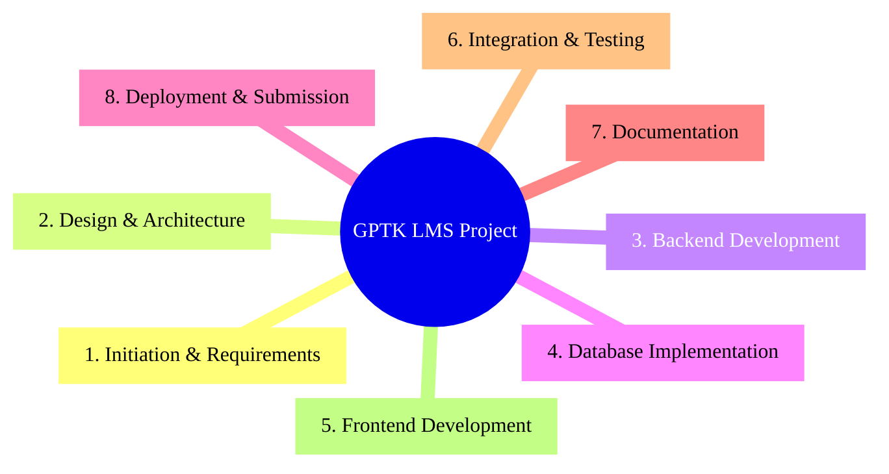

# GPTK LMS Project Mindmap

```mermaid
%%{
  init: {
    'theme': 'default',
    'themeVariables': {
      'fontFamily': 'Times New Roman, Times, serif'
    }
  }
}%%
mindmap
  root(("GPTK LMS Project"))
    id1["1. Initiation & Requirements"]
    id2["2. Design & Architecture"]
    id3["3. Backend Development"]
    id4["4. Database Implementation"]
    id8["8. Deployment & Submission"]
    id7["7. Documentation"]
    id6["6. Integration & Testing"]
    id5["5. Frontend Development"]
```
