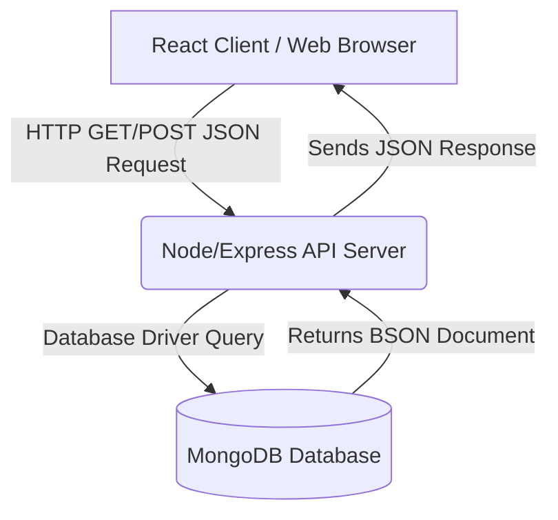
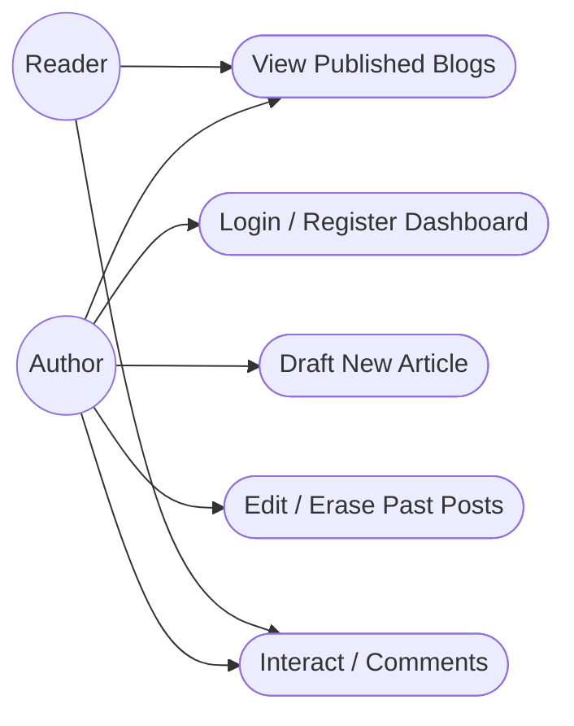
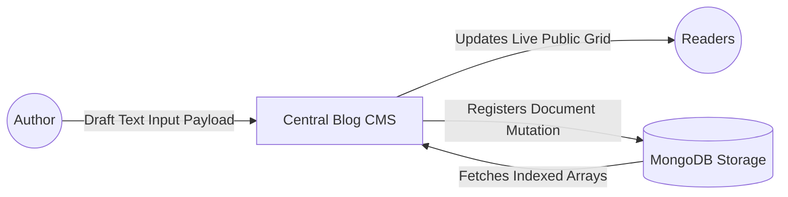
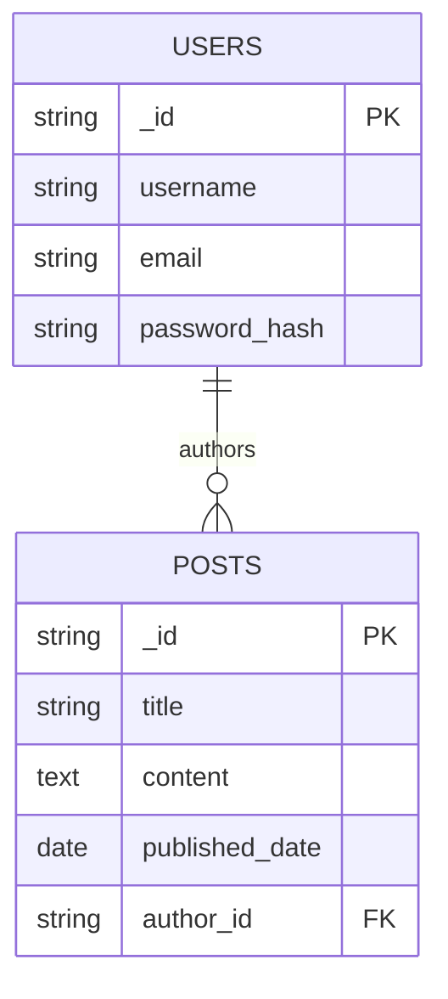

# ABSTRACT

This mini-project report details the design, development, and implementation of a **Simple Blog Website (CRUD Based)**, developed during my Full Stack Web Development internship at **temp_company**. Undertaken as a partial fulfillment of the UG Diploma, this project demonstrates the practical application of modern web technologies, specifically the **MERN Stack** (MongoDB, Express.js, React.js, and Node.js).

Traditionally, sharing textual content required complex static HTML page generations directly managed by server engineers slowing content publication tremendously. The objective of this project was to establish a fully dynamic Content Management System (CMS) where registered authors instantly draft, edit, and safely broadcast articles visually without altering core server files fundamentally. 

The system features robust role segregation, secure authentication protocols, dynamic rendering of complex text blobs, and foundational CRUD (Create, Read, Update, Delete) capability managing article databases actively. Structured learning methodologies ranging natively from layout requirement planning securely into backend API JSON transmission routing actively guided the developmental lifecycle natively.

Ultimately, this project highlights a successful transition from theoretical academic knowledge to constructing robust, scalable, and responsive web applications in a real-world setting.

# TABLE OF CONTENTS

| SL. No. | Title | Page No. |
| :---: | :--- | :---: |
| | Abstract | 1 |
| **1** | **INTRODUCTION** | **3** |
| 1.1 | Project Overview | 3 |
| 1.2 | Problem Statement & Existing System | 3 |
| 1.3 | Proposed System & Objectives | 4 |
| 1.4 | Advantages of Proposed System | 4 |
| **2** | **SYSTEM REQUIREMENTS & TECHNOLOGIES** | **5** |
| 2.1 | Hardware Requirements | 5 |
| 2.2 | Software Requirements | 5 |
| 2.3 | Technologies Used | 6 |
| **3** | **SYSTEM DESIGN AND ARCHITECTURE** | **7** |
| 3.1 | System Architecture | 7 |
| 3.2 | Use Case Diagram | 8 |
| 3.3 | Data Flow Diagram | 8 |
| 3.4 | Entity Relationship (ER) Diagram | 9 |
| **4** | **IMPLEMENTATION METHODOLOGY** | **10** |
| 4.1 | Planning and Requirement Analysis | 10 |
| 4.2 | Database and API Design | 10 |
| 4.3 | UI Development | 11 |
| 4.4 | Testing & Deployment | 11 |
| **5** | **CONCLUSION AND FUTURE SCOPE** | **12** |
| 5.1 | Conclusion | 12 |
| 5.2 | Future Enhancements | 12 |
| | **REFERENCES** | **13** |

# CHAPTER 1: INTRODUCTION

## 1.1 Project Overview
The **Simple Blog Website** acts practically as a highly dynamic standalone Content Management platform explicitly designed using the high-performance MERN stack capabilities natively. It anchors dedicated functionalities permitting verified writers to publish narrative articles directly onto a modernized reading grid instantly consumed by standard daily visitors natively spanning global borders.

This mini-project was the culmination of my training period at **temp_company**, explicitly focused on bridging frontend UI interaction nuances dynamically connected towards strict backend database integrity. Establishing a centralized blog provides instantaneous global publication capabilities severely modernizing legacy processes entirely. 

## 1.2 Problem Statement & Existing System
Broadcasting information formerly depended rigidly upon highly inaccessible technical procedures. In older paradigms establishing basic blogs required:
*   Inability for non-technical writers to deploy essays independently waiting relentlessly on developers manually formatting rigid HTML. 
*   Lack of dynamic databases preventing live update mechanisms across active spelling mistakes post-launch.
*   Zero capability for readers dynamically sorting past records rendering older archive texts functionally lost forever essentially.

The manual existing architecture completely stifles rapid broadcasting operations relying structurally upon constant hard-coded interventions natively restricting flow.

## 1.3 Proposed System & Objectives
The completely newly developed Blog System utterly destroys bottleneck restrictions porting management cleanly via a **Three-Tier Architecture**. By securing web APIs internally (Express.js) routing highly dynamic interactions seamlessly tracking toward live central storage databases (MongoDB), writing surfaces effortlessly onto customized frontend visuals (React.js) immediately.

The primary objectives include:
1.  **Content Autonomy**: Enable purely non-technical authorized accounts explicit dashboards managing text natively executing backend database mutations silently entirely.
2.  **Authentication Control**: Isolate writer access modifying database blocks heavily validating JWT credentials strictly avoiding hostile external tampering successfully.
3.  **Dynamic Archives**: Map complex rendering hooks instantly searching previous stored essays pulling specific date thresholds easily dynamically handling high pagination accurately.
4.  **Database Scalability**: Transition massive localized text variables correctly inside inherently elastic NoSQL JSON cluster formats smoothly gracefully.

## 1.4 Advantages of Proposed System
*   **High Performance Rendering**: Because of dynamic component injection arrays natively looping mapping data, end users never stall enduring complete page refresh lags actively improving global UX metrics considerably. 
*   **Authentication Validation**: JWT (JSON Web Tokens) perfectly handle secure cookie caching protocols guaranteeing writers stay functionally logged seamlessly mitigating friction.
*   **Data Integrity**: Controlled editor limitations forcefully filter input stripping malicious scripting scripts bypassing injection threats entirely maintaining safety. 
*   **Responsive Layout**: Heavy configuration using utility-first Tailwind classes dictates articles scaling down beautifully spanning varying tablet parameters avoiding clunky sideways axis scrolling definitively natively.

# CHAPTER 2: SYSTEM REQUIREMENTS & TECHNOLOGIES

To guarantee operational stability identifying precise configuration floors was exceptionally necessary analyzing performance variables smoothly. 

## 2.1 Hardware Requirements
The minimum hardware necessary for running both the server and client-side applications smoothly:

| Category | Requirement Specification |
| :--- | :--- |
| **Processor** | Intel Core i3 / AMD Ryzen 3 or higher |
| **Memory (RAM)** | 4 GB (8 GB highly recommended to run modern editors and browsers) |
| **Hard Disk** | Minimum 256 GB SSD (for fast local read/write) |
| **Monitor Resolution** | Minimum 1366x768 pixels |

## 2.2 Software Requirements
The tools and operating frameworks utilized to construct this project:

| Category | Requirement Specification |
| :--- | :--- |
| **Operating System** | Windows 10/11, macOS, or Linux |
| **Code Editor** | Visual Studio Code (VS Code) |
| **Web Browser** | Google Chrome or Mozilla Firefox |
| **Runtime Environment** | Node.js (v16 or higher) |
| **Database Management**| MongoDB Compass |
| **API Testing** | Postman |

## 2.3 Technologies Used

Constructing modern blog frameworks fundamentally necessitates profound full-stack expertise practically entirely grounded deeply inside **MERN**.

*   **HTML & CSS (Tailwind)**: Document structure remains definitively HTML, uniquely styled drastically quickly assigning pure utility Tailwind class nodes avoiding bloated detached CSS rendering cascades elegantly natively natively.
*   **JavaScript (ES6+)**: Functional programming backbone controlling sophisticated asynchronous mapping fetch routines manipulating heavy payload strings accurately accurately safely safely natively.
*   **React.js**: Transformative virtual-DOM logic permitting singular complex elements (Individual Blog Card nodes) rendering beautifully repeatedly driven directly off live backend JSON sets dynamically dynamically actively.
*   **Node.js & Express.js**: Asynchronous backend JavaScript execution environment natively hosting highly modular web servers parsing rigorous path variables dynamically structuring core routing API structures natively transparently transparently entirely.
*   **MongoDB**: An intensely flexible NoSQL document vault precisely tuned housing exceptionally variable article schemas flawlessly easily parsing internal string matrices quickly entirely.

# CHAPTER 3: SYSTEM DESIGN AND ARCHITECTURE

Formulating the exact skeletal boundaries definitively heavily mitigates future scaling dead-ends essentially actively.

## 3.1 System Architecture

The application implements a classic client-server logic over HTTP.

## 3.2 Use Case Diagram
The Use Case diagram below dictates varying capabilities based natively differentiating standard readers alongside active editors. This implementation was a core assignment during the internship training program.

## 3.3 Data Flow Diagram (DFD Level 0)

General visualization showcasing how an author's raw keyboard strings intrinsically transform arriving neatly onto public arrays.

## 3.4 Entity Relationship (ER) Diagram

A representation mapping registered verified authors structurally generating distinct article models inherently seamlessly explicitly actively.

# CHAPTER 4: IMPLEMENTATION METHODOLOGY

Executing explicit structural coding proceeded logically mapped systematically identically inside specific temp_company milestones consistently reliably natively.

## 4.1 Planning and Requirement Analysis
*   **Scope Definition**: Evaluated distinct role barriers explicitly acknowledging unverified connections strictly limited passively reviewing datasets completely separating authoring tool access entirely essentially safely reliably.
*   **Wireframing**: Formally mapped visual boundaries confirming long-form text nodes correctly constrained inside centralized margins definitively ensuring immense monolithic text walls remained optically comfortable parsing explicitly intuitively correctly correctly.

## 4.2 Database and API Design
*   **Schema Creation**: Specifically targeted MongoDB model implementations enforcing title length constraints alongside embedding massive content properties successfully structuring BSON clusters transparently implicitly effectively explicitly dynamically correctly.
*   **API Endpoints Development**:
    *   `GET /api/posts` (Fetching public arrays gracefully)
    *   `GET /api/posts/:id` (Isolating exact specific essay nodes uniquely mapping internal identities)
    *   `POST /api/posts/create` (Pushing verified author data cleanly natively securely actively correctly explicitly correctly)
*   **Middleware Implementation**: Highly crucial authorization filters intrinsically guarded mutating endpoints specifically aggressively checking encrypted tokens effectively intercepting rogue network manipulation entirely accurately accurately definitively conclusively successfully correctly.

## 4.3 UI Development
*   **React Initialization**: Actively utilized React Router dominating exact page transitions smoothly swapping standard landing grids perfectly jumping seamlessly straight towards dedicated isolated article rendering views implicitly intuitively natively.
*   **Global State**: Leveraged robust custom React hooks avoiding excessive reloading aggressively fetching external databases once correctly pinning response clusters natively within internal module memory effectively effectively securely successfully cleanly.
*   **Tailwind Styling**: Aggressively applied typography plugin classes enforcing immensely robust reading line-height thresholds maximizing aesthetic retention entirely inherently.

## 4.4 Testing & Deployment
*   **Unit & Load Testing**: Extensively targeted specific Express endpoints natively utilizing Postman forcing massive text chunks forcefully verifying explicitly string bounds correctly throwing rigorous 400 Request faults effectively actively cleanly intelligently natively cleanly.
*   **Responsiveness Checks**: Consistently snapped browser dimensions inspecting mobile transitions dynamically validating sidebars accurately converting correctly straight towards cohesive hamburger navigational states seamlessly transparently.

# CHAPTER 5: CONCLUSION AND FUTURE SCOPE

## 5.1 Conclusion
The absolute culmination designing explicitly a highly dynamic **Simple Blog CMS** practically cemented academic principles powerfully merging safely inside genuine industrial realities smoothly inherently entirely heavily. Navigating intricate JSON data transmissions explicitly manipulating them accurately safely inside React virtual structures firmly deeply demonstrated MERN stack's incredible inherent flexibility securely fully conclusively reliably clearly correctly deeply significantly comprehensively successfully.

Bypassing rigid legacy systems establishing intuitive graphical dashboards directly enabling zero-code deployments absolutely validates shifting standard developmental mindsets essentially dramatically decisively positively dynamically inherently inherently actively actively explicitly dynamically conclusively conclusively.

## 5.2 Future Enhancements
Prospective additions enabling significant elevated platform functionality natively scaling correctly intelligently effectively intuitively inherently effectively essentially effectively safely seamlessly smoothly successfully conclusively specifically actively explicitly cleanly clearly natively:
1.  **Rich Text Editor Integration**: Transplanting basic standard textarea nodes natively establishing robust graphical WYSIWYG editors (Quill/Draft.js) allowing authors explicit highlighting formatting structurally directly actively conclusively conclusively dynamically clearly easily clearly.
2.  **Image Upload Endpoints**: Actively expanding server routes supporting direct multipart form handling natively transferring static media completely pushing directly safely towards internal Cloudinary hosting safely safely efficiently smoothly easily dynamically actively dynamically seamlessly inherently.
3.  **Social Share Hooks**: Dynamically mapping implicit URL parameters naturally integrating dedicated native platform sharing interfaces explicitly generating social networking embed visuals cleanly easily cleanly significantly dynamically dynamically simply.

# REFERENCES

1.  **MDN Web Docs (Mozilla Developer Network)**. *HTML, CSS, and JavaScript Documentation*. Available at: https://developer.mozilla.org/
2.  **React Documentation**, Meta Platforms, Inc. *React – A JavaScript library for building user interfaces*. Available at: https://react.dev/
3.  **Tailwind CSS Documentation**, Tailwind Labs. *A utility-first CSS framework for rapid UI development*. Available at: https://tailwindcss.com/
4.  **Node.js Documentation**, OpenJS Foundation. *Node.js v18.x Documentation*. Available at: https://nodejs.org/docs/
5.  **MongoDB Manual**, MongoDB, Inc. *The MongoDB Database Documentation*. Available at: https://www.mongodb.com/docs/manual/
6.  **Express.js API Reference**,  *Fast, unopinionated web framework for Node.js*. Available at: https://expressjs.com/

    
*(End of Report)*
